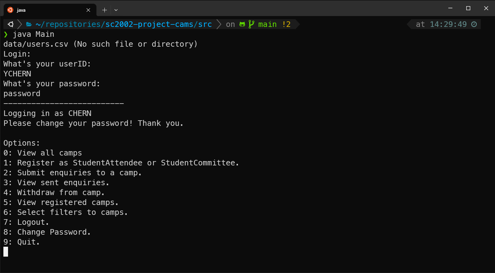

# Camp Application and Management System (CAMs)

## Description

CAMs is an application for staff and students to manage, view and register for camps within NTU. The application acts as a centralized hub for all staff and students. The application is developed as a Command Line Interface (CLI).

Our main learning objectives of the assignment was to:
- apply the Object-Oriented Programming (OOP) concepts
- model, design and develop an OOP application 
- gain familiarity with using Java as an object oriented programming language

## Table of Contents

- [Installation](#installation)
- [Usage](#usage)
- [Credits](#credits)
- [License](#license)

## Installation

Clone the project
```bash
git clone https://github.com/jovantay521/sc2002-project-cams.git
```

## Usage (TODO)

Compile java files
```java
javac src/*.java
```
```java
javac src/Main.java
```

Run the main file
```java
java Main.java
```


```md

```

## Credits

- Jovan ([@jovantay521](https://github.com/jovantay521))
- Sky ([@skylimm](https://github.com/skylimm))
- Chermine ([@cxueminc](https://github.com/cxueminc))
- Jing Jie ([@jingjietan](https://github.com/jingjietan))